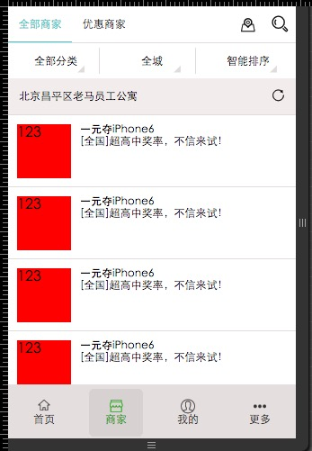

```
npm run build 		打包web端打包文件
npm run html5plus   打包H5 端打包文件
```

```
增加插件
	--save-dev open-browser-webpack-plugin

```
```
总结到两点
	1，export 不写 default 就不会运行到该文件 马上触发
	2，一个index.js 里面可以写 多个 export ,用的时候 找到 index.js ,
			像这样  ： import {ShoYe, ZiXing, YuLei, DianYin} from '../Component/common/index.js';
```

```
字体图标
	src/Iconfont
	import './Iconfont/iconfont.css'; //字体图标
```
```

IconFont 图标


第一步：使用font-face声明字体
@font-face {font-family: 'iconfont';
    src: url('iconfont.eot'); /* IE9*/
    src: url('iconfont.eot?#iefix') format('embedded-opentype'), /* IE6-IE8 */
    url('iconfont.woff') format('woff'), /* chrome、firefox */
    url('iconfont.ttf') format('truetype'), /* chrome、firefox、opera、Safari, Android, iOS 4.2+*/
    url('iconfont.svg#iconfont') format('svg'); /* iOS 4.1- */
}
第二步：定义使用iconfont的样式
.iconfont{
    font-family:"iconfont" !important;
    font-size:16px;font-style:normal;
    -webkit-font-smoothing: antialiased;
    -webkit-text-stroke-width: 0.2px;
    -moz-osx-font-smoothing: grayscale;}
第三步：挑选相应图标并获取字体编码，应用于页面
<i class="iconfont">&#x33;</i>
```
```
公共的东西 可以在 入口处 引用  
	这里在 App.js 里 引用了
			整体图标
			flex.css
			公共样式
```

### 截图



